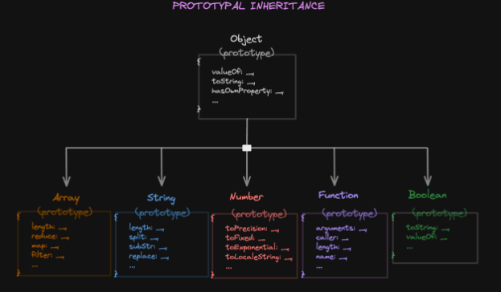

# Prototypal Inheritance in JavaScript 🧬

This repository explains **Prototypal Inheritance**, one of the most fundamental and powerful concepts in JavaScript.

---

## 📘 What is Prototypal Inheritance?

Prototypal Inheritance allows JavaScript objects to inherit properties and methods from other objects. This forms a **prototype chain**.

> Even arrays and functions in JavaScript are objects under the hood — inheriting behavior from their prototypes.

---

## 🔍 Why Use Prototypal Inheritance?

- ✅ **Code Reusability** – Avoid duplication of methods.
- ✅ **Memory Efficiency** – Shared methods live on the prototype.
- ✅ **Runtime Flexibility** – Modify prototypes on the fly.

---

## ⚙️ How it Works

When accessing a property, JavaScript:
1. Looks on the object itself.
2. If not found, traverses up the prototype chain.
3. Stops when it hits `null`.

---

## 📚 Code Examples

### Using Constructor Function

```js
function Person(name) {
  this.name = name;
}

Person.prototype.greet = function () {
  console.log(`Hello, my name is ${this.name}`);
};

const alice = new Person("Alice");
alice.greet(); // Hello, my name is Alice

### 🔗 Prototype Chain Overview


*Visualizing how built-in types like Array, String, and Function inherit from Object in JavaScript.*
